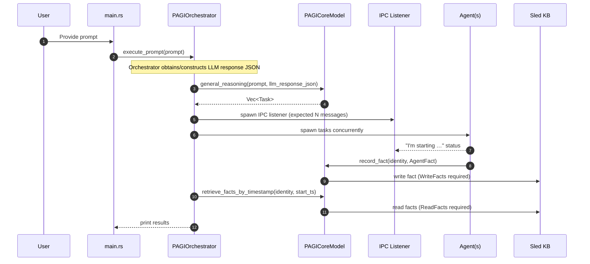
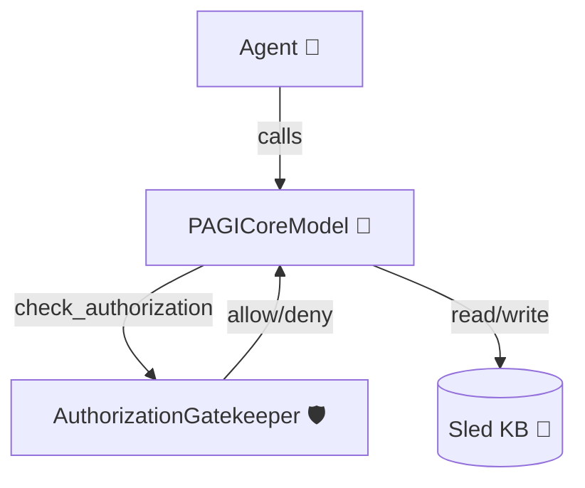

# 🐦‍🔥 Phoenix AGI (PAGI) — Core + Orchestrator

Welcome to **Phoenix AGI (PAGI)** — a research-focused, modular, polyrepo Rust codebase for experimenting with **agent orchestration**, **shared memory/IPC patterns**, **persistent memory**, **neuro-symbolic planning**, and **least-privilege security**.

This workspace is the **shared library repo**: `pagi-core-lib`.

It is intended to be used alongside the sibling executable repo:

- `../pagi-core-lib` (this repo)
- `../pagi-orchestrator-main` (the runnable orchestrator)

---

## ✨ What this project demonstrates

PAGI is intentionally “scaffolding-first”: it uses small, understandable building blocks that you can evolve into more advanced research components.

Key capabilities included:

- 🧠 **Planning model**: `PAGICoreModel` parses an orchestrator-provided LLM plan (JSON) into a `Vec<Task>`.
- 🔌 **Agent contract**: `BaseAgent` trait defines the async agent interface.
- 🛰️ **IPC status streaming**: agents send real-time status messages over a local socket (via `interprocess`).
- 🧾 **Persistent Knowledge Base**: agents write structured facts to a Sled DB.
- 🔁 **Reflection loop**: a reflective agent can seed analysis facts for future runs.
- 🧩 **Neuro-symbolic core**: rule-based inference can modify the plan.
- 🛡️ **Authorization Gatekeeper (PoLP)**: least-privilege scopes gate Knowledge Base reads/writes.
- 📈 **Structured telemetry**: `tracing` spans instrument core planning, KB reads/writes, and PoLP checks.
- 🧭 **Embodiment primitives**: typed multimodal/spatial facts for robotics + sensor inputs.

---

## 🗂️ Repositories

### 1) `pagi-core-lib` (this repo)

Rust **library crate** containing:

- Core structs: `Task`, `AgentFact`
- Core model: `PAGICoreModel`
- Agent trait: `BaseAgent`
- Sled knowledge base helpers (record/retrieve)
- Rule engine (`PAGIRule`) and symbolic directives
- PoLP authorization (`AgentIdentity`, `AuthScope`, `AuthorizationGatekeeper`)

### 2) `pagi-orchestrator-main` (sibling repo)

Rust **binary crate** containing:

- Agent implementations: `SearchAgent`, `CalendarAgent`, `CybersecurityAgent`, `ReflectiveAgent`
- Orchestrator: dynamic registry + concurrent execution
- IPC listener task for live agent status output

---

## 🧱 Architecture

### High-level diagram (polyrepo + dataflow)

```mermaid
flowchart LR
  subgraph CoreRepo[pagi-core-lib 📦]
    CoreModel[PAGICoreModel 🧠]
    Auth[AuthorizationGatekeeper 🛡️]
    KB[(Sled Knowledge Base 🧾)]
    Rules[PAGIRule Engine 🧩]
    IPCName[IPC channel name 🛰️]
  end

  subgraph AppRepo[pagi-orchestrator-main 🚀]
    Main[main.rs ▶️]
    Orch[PAGIOrchestrator 🎛️]
    Agents[Agents 🤖]
    IPCListener[IPC Listener Task 📡]
  end

  Main --> Orch
  Orch --> CoreModel
  CoreModel --> Rules
  Rules --> CoreModel

  Orch --> Agents
  Agents -->|record_fact (WriteFacts)| KB
  Orch -->|retrieve_facts (ReadFacts)| KB
  Auth --> KB

  Agents -->|status updates| IPCListener
  CoreModel --> IPCName
```

### Low-level diagram (single run sequence)



### 🔐 Authorization model (PoLP)

Every agent has an identity with scopes:

- `ReadFacts` — read from Knowledge Base
- `WriteFacts` — write to Knowledge Base
- `WritePolicy` — write security-sensitive policy
- `ExternalAPI` — call external services

The core enforces this via a gatekeeper before doing sensitive operations.



---

## ✅ Dependencies

### `pagi-core-lib` dependencies

- 🧵 `tokio` — async runtime
- 🧬 `serde`, `serde_json` — serialization for tasks/facts
- 🧩 `async-trait` — async trait methods
- 🛰️ `interprocess` — local socket IPC (status updates)
- 🧾 `sled` — embedded persistent database (Knowledge Base)
- 📈 `tracing` — structured spans + events for planning/auth/KB telemetry
- 🧭 `nalgebra` — lightweight spatial primitives (3D vectors) for multimodal/robotics data

### `pagi-orchestrator-main` dependencies

- 🧵 `tokio`
- 🧬 `serde_json`
- 🧩 `async-trait`
- 🧰 `futures` — `join_all` for awaiting spawned tasks
- 🛰️ `interprocess`
- 📈 `tracing`, `tracing-subscriber`, `tracing-appender` — structured logging (console + rolling file)
- � `pagi-core-lib = { path = "../pagi-core-lib" }`

---

## 🛠️ Installation

### Prerequisites

- 🦀 Rust (stable) + Cargo
- Linux/macOS/Windows (IPC has platform differences; Linux is easiest for the demo)

### Clone both repos (sibling folders)

```bash
mkdir -p phoenix-agi && cd phoenix-agi
git clone <YOUR_URL>/pagi-core-lib.git
git clone <YOUR_URL>/pagi-orchestrator-main.git
```

---

## 🚀 Usage

### Run the orchestrator

From inside `pagi-core-lib` (or anywhere), run:

```bash
cargo run --manifest-path ../pagi-orchestrator-main/Cargo.toml
```

### Example prompts

#### 🧪 Research + scheduling (non-security)

```text
Please research the top anti-aging compounds and schedule a team meeting for next week to present the findings.
```

Expected behavior:

- Core produces a plan with Search + Calendar tasks
- Agents write results into Sled KB
- Orchestrator prints facts since start timestamp

#### 🛡️ Security triage

```text
I have a critical SIEM alert in Rapid7. Please initiate triage.
```

Expected behavior:

- Core detects security keywords and returns a plan with **only** `CybersecurityAgent`
- Orchestrator runs the cyber agent, streams status via IPC, and prints KB facts

---

## 🧪 Testing

### Test the core library

```bash
cargo test
```

This includes:

- Planning tests
- Rule-engine tests

### Build the orchestrator

```bash
cargo build --manifest-path ../pagi-orchestrator-main/Cargo.toml
```

---

## 🐛 Debugging

Helpful environment variables:

- 🧵 Enable backtraces:

```bash
RUST_BACKTRACE=1 cargo run --manifest-path ../pagi-orchestrator-main/Cargo.toml
```

- 📈 Increase telemetry verbosity (example):

```bash
RUST_LOG=info,pagi_core_lib=trace cargo run --manifest-path ../pagi-orchestrator-main/Cargo.toml
```

This will show core spans for planning + KB operations, and the orchestrator will also write
rolling log files under `../pagi-orchestrator-main/logs/`.

Troubleshooting tips:

- If IPC fails to bind, you may have a stale socket path (Linux uses `/tmp/pagi_shmem_pipe`).
- If the KB is corrupted (rare), stop all runs and delete the `pagi_knowledge_base/` directory.

---

## 🤝 Contributing

We welcome contributions!

### Development workflow

1. 🍴 Fork the repo(s)
2. 🌿 Create a feature branch
3. ✅ Add tests where possible
4. 🧹 Run formatting and checks:

```bash
cargo fmt
cargo clippy -- -D warnings
cargo test
```

### Style guidelines

- Prefer small, composable modules
- Keep agent logic simple and well-logged
- Avoid long-lived mutable global state (except for controlled experiments)

---

## 🛣️ Roadmap / Future Plans

Near-term:

- 🧵 Move IPC + KB operations to cleaner abstractions (`IpcBus`, `KnowledgeBase`)
- 🔒 Add more granular scopes (e.g., per-tree permissions)
- 🤖 Add more agent types (e.g., `BrowserAgent`, `SummarizerAgent`)

Mid-term:

- 🧠 Replace stub planning with an LLM-backed planner
- 🧩 Expand rule engine with richer conditions (structured predicates, confidence, context)
- 🧾 Add embeddings/vector search (hybrid symbolic + semantic memory)

Long-term:

- 🔁 Background continuous reflection loops with scheduling
- 🧬 Self-improving policy updates under strict authorization
- 🧪 Benchmarks + load tests for concurrency and KB performance

---

## 📄 License

TBD (add a LICENSE file when ready).
